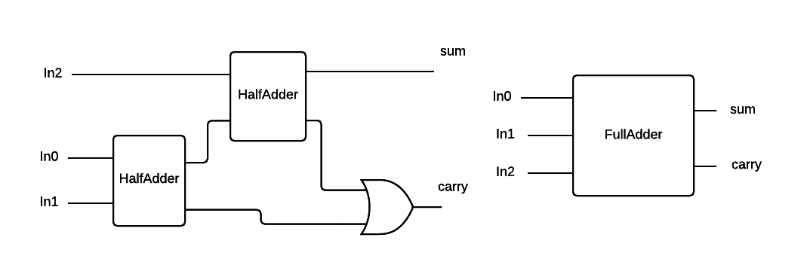
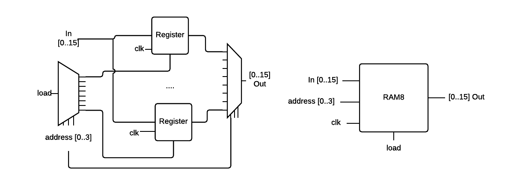
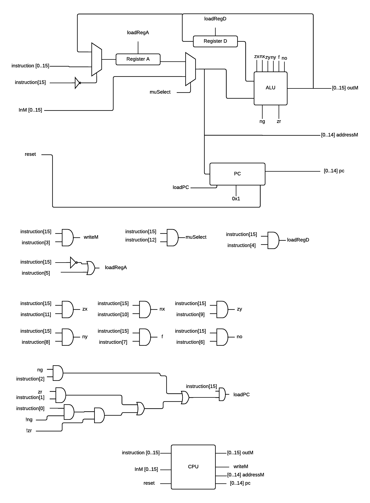

# NAND to Tetris

## Description
This project, based on the course [Nand to Tetris](http://nand2tetris.org), shows an example design of a fully operational,
multipurpose 16-bit computer, constructed using only [NAND](https://en.wikipedia.org/wiki/NAND_gate) logic gates
and basic [flip-flops](https://en.wikipedia.org/wiki/Flip-flop_(electronics)).
This project includes own assembler, compiler, Virtual Machine and basic Operating System.
Design of this computer assumes [memory-mapped I/O](https://en.wikipedia.org/wiki/Memory-mapped_I/O)
is given for the input (keyboard) and output (monitor).
Implementation and design of each component is written in bottom-up manner,
starting from creation of basic logic gates through multiplexers, CPU and ends on [Tetris](https://en.wikipedia.org/wiki/Tetris) game.

## Table of Contents
1. [Hardware](#hardware)
  1. [Basic logic gates](#basic-logic-gates)
    1. [NAND](#nand)
    2. [NOT](#not)
    3. [AND](#and)
    4. [OR](#or)
    5. [XOR](#xor)
  2. [Multiplexers](#multiplexers)
    1. [Multiplexer](#Multiplexer)
    2. [Demultiplexer](#Demultiplexer)
  3. [16 bits versions of gates](#16-bits-versions-of-gates)
    1. [16 bits NOT](#16-bits-not)
    2. [16 bits AND](#16-bits-and)
    3. [16 bits OR](#16-bits-or)
    4. [OR 8 Way](#or-8-way)
    5. [16 bits Multiplexer](#16-bits-multiplexer)
    6. [16 bits Multiplexer 4 Way](#16-bits-multiplexer-4-way)
    7. [16 bits Multiplexer 8 Way](#16-bits-multiplexer-8-way)
    8. [Demultiplexer 4 Way](#demultiplexer-4-way)
    9. [Demultiplexer 8 Way](#demultiplexer-8-way)
  4. [Arithmetic Logic Union](#arithmetic-logic-union)
    1. [Half Adder](#half-adder)
    2. [Full Adder](#full-adder)
    3. [Adder](#adder)
    4. [Incrementer](#incrementer)
    5. [ALU](#alu)
  5. [Memory](#memory)
    1. [Flip-flop](#flip-flop)
    2. [Bit](#bit)
    3. [Register](#register)
    4. [RAM](#ram)
    5. [Program Counter](#program-counter)
  6. [Computer architecture](#computer-architecture)
    1. [Main memory](#main-memory)
    2. [Central Processor Unit](#central-processor-unit)
    3. [Computer](#computer)
2. [Software](#software)
  1. [Assembler](#assembler)
    1. [Assembler Specification](#assembler-specification)
    2. [Assembler Instructions](#assembler-instructions)
    3. [Assembler Symbols](#assembler-symbols)
    4. [Assembler Implementation](#assembler-implementation)
    5. [Assembly Examples](#assembly-examples)

## Hardware
Each piece of hardware is constructed either from basic NAND, Flip-Flop or using already designed elements.
All elements have been described using [Hardware Description Language](https://en.wikipedia.org/wiki/Hardware_description_language)
and can be find in the hardware directory.
This files can be tested using Hardware Simulator in the tool directory.
Additionally there are also presented below as a drawings - each of them contain symbol of that element (on the right/below) and design.

### Basic logic gates
1. [NAND](#nand)
2. [NOT](#not)
3. [AND](#and)
4. [OR](#or)
5. [XOR](#xor)

#### NAND

[NAND](https://en.wikipedia.org/wiki/NAND_gate) gates will be used to construct other logic gates.
It produces *false* only when both its input are *true*.

| In0 | In1 | Out |
| --- | --- | --- |
| 0   | 0   | 1   |
| 0   | 1   | 1   |
| 1   | 0   | 1   |
| 1   | 1   | 0   |


#### NOT

[NOT](https://en.wikipedia.org/wiki/Inverter_(logic_gate)) gate inverts its output.

| In  | Out |
| --- | --- |
| 0   | 1   |
| 1   | 0   |


#### AND

[AND](https://en.wikipedia.org/wiki/AND_gate) gate produces *true* only when both its input are *true*.

| In0 | In1 | Out |
| --- | --- | --- |
| 0   | 0   | 0   |
| 0   | 1   | 0   |
| 1   | 0   | 0   |
| 1   | 1   | 1   |


#### OR

[OR](https://en.wikipedia.org/wiki/OR_gate) gate produces *false* only when both its input are *false*.

| In0 | In1 | Out |
| --- | --- | --- |
| 0   | 0   | 0   |
| 0   | 1   | 1   |
| 1   | 0   | 1   |
| 1   | 1   | 1   |


#### XOR

[XOR](https://en.wikipedia.org/wiki/XOR_gate) gate produces *true* only when exactly one of its input are *true*.

| In0 | In1 | Out |
| --- | --- | --- |
| 0   | 0   | 0   |
| 0   | 1   | 1   |
| 1   | 0   | 1   |
| 1   | 1   | 0   |


### Multiplexers

1. [Multiplexer](#multiplexer)
2. [Demultiplexer](#demultiplexer)

#### Multiplexer

[Multiplexer](https://en.wikipedia.org/wiki/Multiplexer) selects one of its input and forwards to the output.
It has one single select line (below denoted as *sel*) which is used to select which input to use.

| sel | In0 | In1 | Out |
|-----| --- | --- | --- |
| 0   | 0   | 0   | 0   |
| 0   | 0   | 1   | 0   |
| 0   | 1   | 0   | 1   |
| 0   | 1   | 1   | 1   |
| 1   | 0   | 0   | 0   |
| 1   | 0   | 1   | 1   |
| 1   | 1   | 0   | 0   |
| 1   | 1   | 1   | 1   |

Or in the other words:

| sel | Out |
|-----|-----|
| 0   | In0 |
| 1   | In1 |


#### Demultiplexer

[Demultiplexer](https://en.wikipedia.org/wiki/Multiplexer#Digital_demultiplexers)
is opposite of multiplexer - it forwards the input into one of its outputs.
It has one single select line (below denoted as *sel*) which is used to select which output to use.

| sel | In | Out0 | Out1 |
|-----|----|------|------|
| 0   | 0  | 0    | 0    |
| 0   | 1  | 1    | 0    |
| 1   | 0  | 0    | 0    |
| 1   | 1  | 0    | 1    |

Or in the other words:

| sel | Out0 | Out1 |
| --- | ---- | ---- |
| 0   | In   | 0    |
| 1   | 0    | In   |


### 16 bits versions of gates

16 bits version of base logic gates and mutexes.
Notation `[0..15]` indicates 16 bits number where 0 is the least significant digit.

1. [16 bits NOT](#16-bits-not)
2. [16 bits AND](#16-bits-and)
3. [16 bits OR](#16-bits-or)
4. [OR 8 Way](#or-8-way)
5. [16 bits Multiplexer](#16-bits-multiplexer)
6. [16 bits Multiplexer 4 Way](#16-bits-multiplexer-4-way)
7. [16 bits Multiplexer 8 Way](#16-bits-multiplexer-8-way)
8. [Demultiplexer 4 Way](#demultiplexer-4-way)
9. [Demultiplexer 8 Way](#demultiplexer-8-way)

#### 16 bits NOT

Negates each bit independently.


#### 16 bits AND

Bitwise `and` on each pair of bits.


#### 16 bits OR

Bitwise `or` on each pair of bits.


#### OR 8 Way

Returns *false* if all 8 bits of input are set to *false*, *true* otherwise.


#### 16 bits Multiplexer

Selects one of two 16 bits numbers.

| sel | Out |
| --- | --- |
| 0   | In0 |
| 1   | In1 |


#### 16 bits Multiplexer 4 Way

Selects one of four 16 bits numbers.

| sel | Out |
| --- | --- |
| 00  | In0 |
| 01  | In1 |
| 10  | In2 |
| 11  | In3 |


#### 16 bits Multiplexer 8 Way

Selects one of eight 16 bits numbers.

| sel | Out |
| --- | --- |
| 000 | In0 |
| 001 | In1 |
| 010 | In2 |
| 011 | In3 |
| 100 | In4 |
| 101 | In5 |
| 110 | In6 |
| 111 | In7 |


#### Demultiplexer 4 Way

Forwards 16 bits input number into one of four selected outputs.

| sel | Out0 | Out1 | Out2 | Out3 |
| --- | ---- | ---- | ---- | ---- |
| 00  | In   | 0    | 0    | 0    |
| 01  | 0    | In   | 0    | 0    |
| 10  | 0    | 0    | In   | 0    |
| 11  | 0    | 0    | 0    | In   |


#### Demultiplexer 8 Way

Forwards 16 bits input number into one of eight selected outputs.

| sel | Out0 | Out1 | Out2 | Out3 | Out4 | Out5 | Out6 | Out7 |
| --- | ---  | ---- | ---- | ---- | ---- | ---- | ---- | ---- |
| 000 | In   | 0    | 0    | 0    | 0    | 0    | 0    | 0    |
| 001 | 0    | In   | 0    | 0    | 0    | 0    | 0    | 0    |
| 010 | 0    | 0    | In   | 0    | 0    | 0    | 0    | 0    |
| 011 | 0    | 0    | 0    | In   | 0    | 0    | 0    | 0    |
| 100 | 0    | 0    | 0    | 0    | In   | 0    | 0    | 0    |
| 101 | 0    | 0    | 0    | 0    | 0    | In   | 0    | 0    |
| 110 | 0    | 0    | 0    | 0    | 0    | 0    | In   | 0    |
| 111 | 0    | 0    | 0    | 0    | 0    | 0    | 0    | In   |


### Arithmetic Logic Union

1. [Half Adder](#half-adder)
2. [Full Adder](#full-adder)
3. [Adder](#adder)
4. [Incrementer](#incrementer)
5. [ALU](#alu)

#### Half Adder

Used for creating [Full Adder](#full-adder).
Adds two 1 bit numbers and stores the result in *sum* and *carry* where *carry* is [MSB](https://en.wikipedia.org/wiki/Most_significant_bit).

| In0 | In1 | sum | carry |
| --- | --- | --- | ----- |
| 0   | 0   | 0   | 0     |
| 0   | 1   | 1   | 0     |
| 1   | 0   | 1   | 0     |
| 1   | 1   | 0   | 1     |


#### Full Adder

Used for creating [Adder](#adder).
Adds three 1 bit numbers and stores the result in *sum* and *carry* where *carry* is [MSB](https://en.wikipedia.org/wiki/Most_significant_bit).

| In0 | In1 | In2 | sum | carry |
| --- | --- | --- | --- | ----- |
| 0   | 0   | 0   | 0   | 0     |
| 0   | 0   | 1   | 1   | 0     |
| 0   | 1   | 0   | 1   | 0     |
| 0   | 1   | 1   | 0   | 1     |
| 1   | 0   | 0   | 1   | 0     |
| 1   | 0   | 1   | 0   | 1     |
| 1   | 1   | 0   | 0   | 1     |
| 1   | 1   | 1   | 1   | 1     |



#### Adder

Adds two 16-bit values.
The most significant carry bit is ignored.


#### Incrementer

16 bits Incrementer. Increases the input value by 1.


#### ALU

16 bits [Arithmetic Logic Union](https://en.wikipedia.org/wiki/Arithmetic_logic_unit).

ALU assumes that each 16 bit number is [Two's complement](#https://en.wikipedia.org/wiki/Two%27s_complement).
Thus the maximum is `2^15 - 1 = 32767` and minimum is `-2^15 = -32768`.

ALU can computes one of the following functions for two 16 bits numbers `x` and `y`:
`x+y, x-y, y-x, 0, 1, -1, x, y, -x, -y, !x, !y, x+1, y+1, x-1, y-1, x&y, x|y`,
according to 6 input bits denoted `zx, nx, zy, ny, f, no`.

In addition, the ALU computes two 1-bit outputs:
if the ALU output == 0, `zr` is set to 1; otherwise `zr` is set to 0;
if the ALU output < 0, `ng` is set to 1; otherwise `ng` is set to 0.

`zx` - zero `x`

`nx` - negate `x`

`zy` - zero `y`

`zy` - negate `y`

`f == 0` - computes `x & y`

`f == 1` - computes `x + y`

`no` - negate output

| zx  | nx  | zy  | ny  | f   | no  | Out  |
| --- | --- | --- | --- | --- | --- | ---- |
| 1   | 0   | 1   | 0   | 0   | 0   | 0    |
| 1   | 1   | 1   | 1   | 1   | 1   | 1    |
| 1   | 1   | 1   | 0   | 1   | 0   | -1   |
| 0   | 0   | 1   | 1   | 0   | 0   | x    |
| 1   | 1   | 0   | 0   | 0   | 0   | y    |
| 0   | 0   | 1   | 1   | 0   | 1   | !x   |
| 1   | 1   | 0   | 0   | 0   | 1   | !y   |
| 0   | 0   | 1   | 1   | 1   | 1   | -x   |
| 1   | 1   | 0   | 0   | 1   | 1   | -y   |
| 0   | 1   | 1   | 1   | 1   | 1   | x+1  |
| 1   | 1   | 0   | 1   | 1   | 1   | y+1  |
| 0   | 0   | 1   | 1   | 1   | 0   | x-1  |
| 1   | 1   | 0   | 0   | 1   | 0   | y-1  |
| 0   | 0   | 0   | 0   | 1   | 0   | x+y  |
| 0   | 1   | 0   | 0   | 1   | 1   | x-y  |
| 0   | 0   | 0   | 1   | 1   | 1   | y-x  |
| 0   | 0   | 0   | 0   | 0   | 0   | x&y  |
| 0   | 1   | 0   | 1   | 0   | 1   | x\|y |


### Memory

[Memory](https://en.wikipedia.org/wiki/Computer_memory) is a device used to store information.

1. [Flip-flop](#flip-flop)
2. [Bit](#bit)
3. [Register](#register)
4. [RAM](#ram)
5. [Program Counter](#program-counter)

#### Flip-flop

Flip-flop is a circuit that has two stables states and is used to store state information.
It returns its input in next clock cycle.


#### Bit

[Bit](https://en.wikipedia.org/wiki/Bit) stores one bit of information.

| load | out(t) | out(t+1) |
| ---- | ------ | -------- |
| 0    | 0      | 0        |
| 0    | 1      | 1        |
| 1    | 0      | In       |
| 1    | 1      | In       |


#### Register

[Register](https://en.wikipedia.org/wiki/Processor_register) stores one 16 bits number.


#### RAM

[Random Access Memory](https://en.wikipedia.org/wiki/Random-access_memory),
build of several registers, allows to read and write to given *address* in almost the same amount of time irrespectively of its physical location.

##### RAM with 8 registers



##### RAM with 64 registers


##### RAM with 512 registers


##### RAM with 4096 registers


##### RAM with 16384 registers


#### Program Counter

[Program Counter](https://en.wikipedia.org/wiki/Program_counter) indicates the address of a next instruction.

 ```
 if (reset[t] == 1) out[t+1] = 0
 else if (load[t] == 1) out[t+1] = in[t]
 else if (inc[t] == 1) out[t+1] = out[t] + 1 (integer addition)
 else out[t+1] = out[t]
```


### Computer architecture

1. [Main memory](#main-memory)
2. [Central Processor Unit](#central-processor-unit)
3. [Computer](#computer)

#### Main memory

Returns value stored at given address in next clock cycle.

The complete address space of the computer's memory,
including RAM and memory-mapped I/O. 
The chip facilitates read and write operations, as follows:

    Read:  out(t) = Memory[address(t)](t)

    Write: if load(t-1) then Memory[address(t-1)](t) = in(t-1)

In words: the chip always outputs the value stored at the memory 
location specified by address. If load==1, the in value is loaded 
into the memory location specified by address. This value becomes 
available through the out output from the next time step onward.
Address space rules:

Only the upper 16K+8K+1 words of the Memory chip are used. 

Access to address>0x6000 is invalid. Access to any address in 
the range 0x4000-0x5FFF results in accessing the screen memory 
map. Access to address 0x6000 results in accessing the keyboard 
memory map. The behavior in these addresses is described in the 


#### Central Processor Unit

The machine language used for the CPU is based on two 16 bits command types.

The *address instruction* has the format `0vvvvvvvvvvvvvvv`, each `v` being 0 or 1.
This instruction causes the computer to load the 15 bits constant `vvvvvvvvvvvvvvv` into Register A.

The *compute instruction* has the format `111accccccdddjjj`.
The `a` and `c` bits instructs ALU which function to compute,
the `d` bits instructs where to store ALU output,
the `j` bits specify an optional jump condition.

The `cccccc` corresponds exactly to the ALU inputs: `zx`, `nx`, `zy`, `ny`, `f`, `no`.

The CPU consist of two registers: `Register A` and `Register D`.
The `A` and `D` values indicates memory stored in register either `A` or `D`.
`M` indicates value stored in memory at address `A` i.e. `M=memory[A]`.

| a=0  | a=1  | zx  | nx  | zy  | ny  | f   | no  |
| ---- | ---- | --- | --- | --- | --- | --- | --- |
| 0    | 0    | 1   | 0   | 1   | 0   | 1   | 0   |
| 1    | 1    | 1   | 1   | 1   | 1   | 1   | 1   |
| -1   | -1   | 1   | 1   | 1   | 0   | 1   | 0   |
| D    | D    | 0   | 0   | 1   | 1   | 0   | 0   |
| A    | M    | 1   | 1   | 0   | 0   | 0   | 0   |
| !D   | !D   | 0   | 0   | 1   | 1   | 0   | 1   |
| !A   | !M   | 1   | 1   | 0   | 0   | 0   | 1   |
| -D   | -D   | 0   | 0   | 1   | 1   | 1   | 1   |
| -A   | -M   | 1   | 1   | 0   | 0   | 1   | 1   |
| D+1  | D+1  | 0   | 1   | 1   | 1   | 1   | 1   |
| A+1  | M+1  | 1   | 1   | 0   | 1   | 1   | 1   |
| D-1  | D-1  | 0   | 0   | 1   | 1   | 1   | 0   |
| A-1  | M-1  | 1   | 1   | 0   | 0   | 1   | 0   |
| D+A  | D+M  | 0   | 0   | 0   | 0   | 1   | 0   |
| D-A  | D-M  | 0   | 1   | 0   | 0   | 1   | 1   |
| A-D  | M-D  | 0   | 0   | 0   | 1   | 1   | 1   |
| D&A  | D&M  | 0   | 0   | 0   | 0   | 0   | 0   |
| D\|A | D\|M | 0   | 1   | 0   | 1   | 0   | 1   |

CPU allows you to store results in registers `A` and `D` or in the memory `M`.
These results may be stored in any of them simultaneously.

| d   | d   | d   |      |
| --- | --- | --- | ---- |
| 0   | 0   | 0   | null |
| 0   | 0   | 1   | M    |
| 0   | 1   | 0   | D    |
| 0   | 1   | 1   | MD   |
| 1   | 0   | 0   | A    |
| 1   | 0   | 1   | MA   |
| 1   | 1   | 0   | DA   |
| 1   | 1   | 1   | MDA  |

CPU allows unconditional (`JMP`) and conditional jumps depending of the ALU output.
If jump is called the next instruction is taken from register A.

| j   | j   | j   |      |
| --- | --- | --- | ---- |
| 0   | 0   | 0   | null |
| 0   | 0   | 1   | JGT  |
| 0   | 1   | 0   | JEQ  |
| 0   | 1   | 1   | JGE  |
| 1   | 0   | 0   | JLT  |
| 1   | 0   | 1   | JNE  |
| 1   | 1   | 0   | JLE  |
| 1   | 1   | 1   | JMP  |



#### Computer


## Software

### Assembler

1. [Assembler Specification](#assembler-specification)
2. [Assembler Instructions](#assembler-instructions)
3. [Assembler Symbols](#assembler-symbols)
4. [Assembler Implementation](#assembler-implementation)
5. [Assembly Examples](#assembly-examples)

Main goal of Assembler is to translate low-level assembly code into machine language instruction.
All machine language instructions are presented in [Central Processor Unit](#central-processor-unit) section.

#### Assembler Specification

Assembly language is composed of either an instruction or a symbol declaration:

_Instruction_: an *address* or a *compute* instructions, described in section [Assembler Instructions](#assembler-instructions).

_(Symbol)_: This pseudo-command binds the Symbol to the memory location
into which the next command in the program will be stored.
It is called `pseudocommand` since it generates no machine code.

_Constants and Symbols_: *Constants* must be non-negative and are written in decimal
notation. A user-defined symbol can be any sequence of letters, digits, underscore,
dot, dollar sign, and colon that does not begin with a digit.

_Comments_ Text beginning with two slashes and ending at the end of the line is
considered a comment and is ignored.

_White Space_ Space characters are ignored. Empty lines are ignored.

_Case Conventions_ All the assembly mnemonics must be written in uppercase. The
rest (user-defined labels and variable names) is case sensitive.

#### Assembler Instructions

Described machine language consist of two instruction types called *address* and *compute* instructions.

_Address Instruction_: `@value`
Value is non-negative decimal number or a symbol referring to such number.
It corresponds to `0vvvvvvvvvvvvvvv` machine language instruction - hence the value can be maximally `2^15-1=32767`.

_Compute Instruction_: `dest=comp;jump`
Either `dest` or `jump` fields may be omitted.
If `dest` is empty, the `=` is omitted.
If `jump` is empty, the `;` is omitted.
It corresponds to `111accccccdddjjj` machine language instruction. `dest` corresponds to `ddd`, `comp` to `acccccc` and `jump` to `jjj`.

#### Assembler Symbols

Assembly commands can refer to memory locations (addresses) using either constants or symbols.
Symbols in assembly programs arise from three sources.

_Predefined Symbols_ Any assembly program is allowed to use the following predefined symbols.

| Label  | RAM address   |
| ------ | ------------- |
| SP     | 0x0000        |
| LCL    | 0x0001        |
| ARG    | 0x0002        |
| THIS   | 0x0003        |
| THAT   | 0x0004        |
| R0-R15 | 0x0000-0x000F |
| SCREEN | 0x4000        |
| KBD    | 0x6000        |

_Label Symbol_ The pseudo-command `(xxx)` defines the symbol `xxx` to refer to the
instruction memory location holding the next command in the program. A label can
be defined only once and can be used anywhere in the assembly program, even before
the line in which it is defined.

_Variable Symbols_ Any symbol `xxx` appearing in an assembly program that is
not predefined and is not defined elsewhere using the `(xxx)` command is treated as
a variable. Variables are mapped to consecutive memory locations as they are first
encountered, starting at RAM address 16 (0x0010).

#### Assembler Implementation

Assembler is located in `software/assembler` and is written in [Go](https://golang.org/). To use it, first build in from that directory:
`go build`
This will create the binary which takes the assembly file as an argument and creates file containing corresponding machine language code.
On Linux, command
`./assembler SomeFile.asm`
will create file `SomeFile.hack` for correct assembly file or will print an error to `stderr`.

Logic of the Assembler is divided onto separate modules:

* *Parser* is responsible for reading the input file, filtering out white space and comments and providing access to commands components.
* *Code* is responsible for coding each instruction into machine language.
* *Symbol Table* is responsible for translating [Assembler Symbols](#assembler-symbols) onto physical addresses.
* *Assembler* uses above modules to create final results.

Assembler parsers file twice. In first iteration it counts all the *address* and *compute* commands and stores *Label* symbols addresses.
In the second iteration it translates all all the *address* and *compute* commands and substitutes *symbols* with physical addresses.
If an error occurs during any of this phase, program is stopped and error containing line at which problem occurred will be printed to `stderr`.

#### Assembly Examples

Few examples of the Assembly language are stored at `software/assembler-examples`.
You may test it using `CPUEmulator` stored in `tools` directory.
