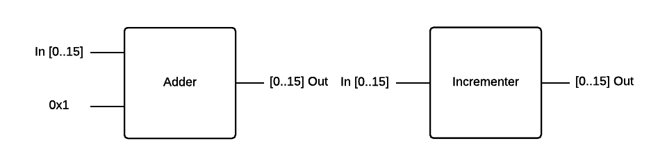

# NAND to Tetris

## Description
This project, based on the course [Nand to Tetris](http://nand2tetris.org), shows an example design of a fully operational,
multipurpose 16-bit computer, constructed using only [NAND](https://en.wikipedia.org/wiki/NAND_gate) logic gates
and basic [flip-flops](https://en.wikipedia.org/wiki/Flip-flop_(electronics)).
This project includes own assembler, compiler, Virtual Machine and basic Operating System.
Design of this computer assumes [memory-mapped I/O](https://en.wikipedia.org/wiki/Memory-mapped_I/O)
is given for the input (keyboard) and output (monitor).
Implementation and design of each component is written in bottom-up manner,
starting from creation of basic logic gates through multiplexers, CPU and ends on Tetris game.

## Table of Contents
1. [Hardware](#hardware)
  1. [Basic logic gates](#basic-logic-gates)
    1. [NAND](#nand)
    2. [NOT](#not)
    3. [AND](#and)
    4. [OR](#or)
    5. [XOR](#xor)
  2. [Multiplexers](#multiplexers)
    1. [Multiplexer](#Multiplexer)
    2. [Demultiplexer](#Demultiplexer)
  3. [16 bits versions of gates](#16-bits-versions-of-gates)
    1. [16 bits NOT](#16-bits-not)
    2. [16 bits AND](#16-bits-and)
    3. [16 bits OR](#16-bits-or)
    4. [OR 8 Way](#or-8-way)
    5. [16 bits Multiplexer](#16-bits-multiplexer)
    6. [16 bits Multiplexer 4 Way](#16-bits-multiplexer-4-way)
    7. [16 bits Multiplexer 8 Way](#16-bits-multiplexer-8-way)
    8. [Demultiplexer 4 Way](#demultiplexer-4-way)
    9. [Demultiplexer 8 Way](#demultiplexer-8-way)
  4. [Arithmetic Logic Union](#arithmetic-logic-union)
    1. [Half Adder](#half-adder)
    2. [Full Adder](#full-adder)
    3. [Adder](#adder)
    4. [Incrementer](#incrementer)
    5. [ALU](#alu)
  5. [Memory](#memory)
    1. [Flip-flop](#flip-flop)
    2. [Bit](#bit)
    3. [Register](#register)
    4. [RAM with 8 registers](#ram-with-8-registers)
    5. [RAM with 64 registers](#ram-with-64-registers)
    6. [RAM with 512 registers](#ram-with-512-registers)
    7. [RAM with 4096 registers](#ram-with-4096-registers)
    8. [RAM with 16384 registers](#ram-with-16384-registers)
    9. [Program Counter](#program-counter)
  6. [Computer architecture](#computer-architecture)
    1. [Main memory](#main-memory)
    2. [Central Processor Unit](#central-processor-unit)
    3. [Computer](#computer)
2. [Software](#software)

## Hardware
Each piece of hardware is constructed either from basic NAND, Flip-Flop or using already designed elements.
All elements have been described using [Hardware Description Language](https://en.wikipedia.org/wiki/Hardware_description_language)
and can be find in the hardware directory.
This files can be tested using Hardware Simulator in the tool directory.
Additionally there are also presented below as a drawings - each of them contain symbol of that element (on the right/below) and design.

### Basic logic gates
1. [NAND](#nand)
2. [NOT](#not)
3. [AND](#and)
4. [OR](#or)
5. [XOR](#xor)

#### NAND
NAND gates will be used to construct other logic gates.

| In0 | In1 | Out |
| --- | --- | --- |
| 0   | 0   | 1   |
| 0   | 1   | 1   |
| 1   | 0   | 1   |
| 1   | 1   | 0   |


#### NOT

| In  | Out |
| --- | --- |
| 0   | 1   |
| 1   | 0   |


#### AND

| In0 | In1 | Out |
| --- | --- | --- |
| 0   | 0   | 0   |
| 0   | 1   | 0   |
| 1   | 0   | 0   |
| 1   | 1   | 1   |


#### OR

| In0 | In1 | Out |
| --- | --- | --- |
| 0   | 0   | 0   |
| 0   | 1   | 1   |
| 1   | 0   | 1   |
| 1   | 1   | 1   |


#### XOR

| In0 | In1 | Out |
| --- | --- | --- |
| 0   | 0   | 0   |
| 0   | 1   | 1   |
| 1   | 0   | 1   |
| 1   | 1   | 0   |


### Multiplexers

1. [Multiplexer](#multiplexer)
2. [Demultiplexer](#demultiplexer)

#### Multiplexer

| sel | In0 | In1 | Out |
|-----| --- | --- | --- |
| 0   | 0   | 0   | 0   |
| 0   | 0   | 1   | 0   |
| 0   | 1   | 0   | 1   |
| 0   | 1   | 1   | 1   |
| 1   | 0   | 0   | 0   |
| 1   | 0   | 1   | 1   |
| 1   | 1   | 0   | 0   |
| 1   | 1   | 1   | 1   |

Or in the other words:

| sel | Out |
|-----|-----|
| 0   | In0 |
| 1   | In1 |


#### Demultiplexer

| sel | In | Out0 | Out1 |
|-----|----|------|------|
| 0   | 0  | 0    | 0    |
| 0   | 1  | 1    | 0    |
| 1   | 0  | 0    | 0    |
| 1   | 1  | 0    | 1    |

Or in the other words:

| sel | Out0 | Out1 |
| --- | ---- | ---- |
| 0   | In   | 0    |
| 1   | 0    | In   |


### 16 bits versions of gates

16 bits version of base logic gates and mutexes.
Notation `[0..15]` indicates 16 bits number where 0 is the least significant digit.

1. [16 bits NOT](#16-bits-not)
2. [16 bits AND](#16-bits-and)
3. [16 bits OR](#16-bits-or)
4. [OR 8 Way](#or-8-way)
5. [16 bits Multiplexer](#16-bits-multiplexer)
6. [16 bits Multiplexer 4 Way](#16-bits-multiplexer-4-way)
7. [16 bits Multiplexer 8 Way](#16-bits-multiplexer-8-way)
8. [Demultiplexer 4 Way](#demultiplexer-4-way)
9. [Demultiplexer 8 Way](#demultiplexer-8-way)

#### 16 bits NOT

Negates each bit independently.


#### 16 bits AND

Bitwise `and` on each pair of bits.


#### 16 bits OR

Bitwise `or` on each pair of bits.


#### OR 8 Way

Returns 0 if all 8 bits for both of numbers are set to 0, 1 otherwise.


#### 16 bits Multiplexer

| sel | Out |
| --- | --- |
| 0   | In0 |
| 1   | In1 |


#### 16 bits Multiplexer 4 Way

| sel | Out |
| --- | --- |
| 00  | In0 |
| 01  | In1 |
| 10  | In2 |
| 11  | In3 |


#### 16 bits Multiplexer 8 Way

| sel | Out |
| --- | --- |
| 000 | In0 |
| 001 | In1 |
| 010 | In2 |
| 011 | In3 |
| 100 | In4 |
| 101 | In5 |
| 110 | In6 |
| 111 | In7 |


#### Demultiplexer 4 Way

| sel | Out0 | Out1 | Out2 | Out3 |
| --- | ---- | ---- | ---- | ---- |
| 00  | In   | 0    | 0    | 0    |
| 01  | 0    | In   | 0    | 0    |
| 10  | 0    | 0    | In   | 0    |
| 11  | 0    | 0    | 0    | In   |


#### Demultiplexer 8 Way

| sel | Out0 | Out1 | Out2 | Out3 | Out4 | Out5 | Out6 | Out7 |
| --- | ---  | ---- | ---- | ---- | ---- | ---- | ---- | ---- |
| 000 | In   | 0    | 0    | 0    | 0    | 0    | 0    | 0    |
| 001 | 0    | In   | 0    | 0    | 0    | 0    | 0    | 0    |
| 010 | 0    | 0    | In   | 0    | 0    | 0    | 0    | 0    |
| 011 | 0    | 0    | 0    | In   | 0    | 0    | 0    | 0    |
| 100 | 0    | 0    | 0    | 0    | In   | 0    | 0    | 0    |
| 101 | 0    | 0    | 0    | 0    | 0    | In   | 0    | 0    |
| 110 | 0    | 0    | 0    | 0    | 0    | 0    | In   | 0    |
| 111 | 0    | 0    | 0    | 0    | 0    | 0    | 0    | In   |


### Arithmetic Logic Union

1. [Half Adder](#half-adder)
2. [Full Adder](#full-adder)
3. [Adder](#adder)
4. [Incrementer](#incrementer)
5. [ALU](#alu)

#### Half Adder

Used for creating [Full Adder](#full-adder).

| In0 | In1 | sum | carry |
| --- | --- | --- | ----- |
| 0   | 0   | 0   | 0     |
| 0   | 1   | 1   | 0     |
| 1   | 0   | 1   | 0     |
| 1   | 1   | 0   | 1     |


#### Full Adder

Used for creating [Adder](#adder).

| In0 | In1 | In2 | sum | carry |
| --- | --- | --- | --- | ----- |
| 0   | 0   | 0   | 0   | 0     |
| 0   | 0   | 1   | 1   | 0     |
| 0   | 1   | 0   | 1   | 0     |
| 0   | 1   | 1   | 0   | 1     |
| 1   | 0   | 0   | 1   | 0     |
| 1   | 0   | 1   | 0   | 1     |
| 1   | 1   | 0   | 0   | 1     |
| 1   | 1   | 1   | 1   | 1     |


#### Adder

Adds two 16-bit values.
The most significant carry bit is ignored.


#### Incrementer

16 bits Incrementer. Increases the input value by 1.



#### ALU

16 bits Arithmetic Logic Union.

Computes one of the following functions:

`x+y, x-y, y-x, 0, 1, -1, x, y, -x, -y, !x, !y, x+1, y+1, x-1, y-1, x&y, x|y`

on two 16-bit inputs, according to 6 input bits denoted `zx, nx, zy, ny, f, no`.
In addition, the ALU computes two 1-bit outputs:

if the ALU output == 0, `zr` is set to 1; otherwise `zr` is set to 0;

if the ALU output < 0, `ng` is set to 1; otherwise `ng` is set to 0.

`zx` - zero `x`

`nx` - negate `x`

`zy` - zero `y`

`zy` - negate `y`

`f == 0` - computes `x & y`

`f == 1` - computes `x + y`

`no` - negate output

| zx  | nx  | zy  | ny  | f   | no  | Out  |
| --- | --- | --- | --- | --- | --- | ---- |
| 1   | 0   | 1   | 0   | 0   | 0   | 0    |
| 1   | 1   | 1   | 1   | 1   | 1   | 1    |
| 1   | 1   | 1   | 0   | 1   | 0   | -1   |
| 0   | 0   | 1   | 1   | 0   | 0   | x    |
| 1   | 1   | 0   | 0   | 0   | 0   | y    |
| 0   | 0   | 1   | 1   | 0   | 1   | !x   |
| 1   | 1   | 0   | 0   | 0   | 1   | !y   |
| 0   | 0   | 1   | 1   | 1   | 1   | -x   |
| 1   | 1   | 0   | 0   | 1   | 1   | -y   |
| 0   | 1   | 1   | 1   | 1   | 1   | x+1  |
| 1   | 1   | 0   | 1   | 1   | 1   | y+1  |
| 0   | 0   | 1   | 1   | 1   | 0   | x-1  |
| 1   | 1   | 0   | 0   | 1   | 0   | y-1  |
| 0   | 0   | 0   | 0   | 1   | 0   | x+y  |
| 0   | 1   | 0   | 0   | 1   | 1   | x-y  |
| 0   | 0   | 0   | 1   | 1   | 1   | y-x  |
| 0   | 0   | 0   | 0   | 0   | 0   | x&y  |
| 0   | 1   | 0   | 1   | 0   | 1   | x\|y |


### Memory

1. [Flip-flop](#flip-flop)
2. [Bit](#bit)
3. [Register](#register)
4. [RAM with 8 registers](#ram-with-8-registers)
5. [RAM with 64 registers](#ram-with-64-registers)
6. [RAM with 512 registers](#ram-with-512-registers)
7. [RAM with 4096 registers](#ram-with-4096-registers)
8. [RAM with 16384 registers](#ram-with-16384-registers)
9. [Program Counter](#program-counter)

#### Flip-flop

Flip-flop is a circuit that has two stables states and is used to store state information.
It returns its input in next clock cycle.


#### Bit

| load | out(t) | out(t+1) |
| ---- | ------ | -------- |
| 0    | 0      | 0        |
| 0    | 1      | 1        |
| 1    | 0      | In       |
| 1    | 1      | In       |


##### Register

16 bit register.


#### RAM with 8 registers

Returns value stored at given address in next clock cycle.


#### RAM with 64 registers

Returns value stored at given address in next clock cycle.


#### RAM with 512 registers

Returns value stored at given address in next clock cycle.


#### RAM with 4096 registers

Returns value stored at given address in next clock cycle.


#### RAM with 16384 registers

Returns value stored at given address in next clock cycle.


#### Program Counter

 A 16-bit counter with load and reset control bits.

 ```
 if (reset[t] == 1) out[t+1] = 0
 else if (load[t] == 1) out[t+1] = in[t]
 else if (inc[t] == 1) out[t+1] = out[t] + 1 (integer addition)
 else out[t+1] = out[t]
```


### Computer architecture

1. [Main memory](#main-memory)
2. [Central Processor Unit](#central-processor-unit)
3. [Computer](#computer)

#### Main memory

Returns value stored at given address in next clock cycle.

The complete address space of the computer's memory,
including RAM and memory-mapped I/O. 
The chip facilitates read and write operations, as follows:

    Read:  out(t) = Memory[address(t)](t)

    Write: if load(t-1) then Memory[address(t-1)](t) = in(t-1)

In words: the chip always outputs the value stored at the memory 
location specified by address. If load==1, the in value is loaded 
into the memory location specified by address. This value becomes 
available through the out output from the next time step onward.
Address space rules:

Only the upper 16K+8K+1 words of the Memory chip are used. 

Access to address>0x6000 is invalid. Access to any address in 
the range 0x4000-0x5FFF results in accessing the screen memory 
map. Access to address 0x6000 results in accessing the keyboard 
memory map. The behavior in these addresses is described in the 


#### Central Processor Unit

The machine language used for the CPU is based on two 16 bits command types.

The *address instruction* has the format `0vvvvvvvvvvvvvvv`, each `v` being 0 or 1.
This instruction causes the computer to load the 15 bits constant `vvvvvvvvvvvvvvv` into Register A.

The *compute instruction* has the format `111accccccdddjjj`.
The `a` and `c` bits instructs ALU which function to compute,
the `d` bits instructs where to store ALU output,
the `j` bits specify an optional jump condition.

The `cccccc` corresponds exactly to the ALU inputs: `zx`, `nx`, `zy`, `ny`, `f`, `no`.

The CPU consist two registers: `Register A` and `Register D`.
The `A` and `D` values indicates memory stored in register either `A` or `D`.
`M` indicates value stored in memory at address `A` i.e. `M=memory[A]`.

| a=0  | a=1  | zx  | nx  | zy  | ny  | f   | no  |
| ---- | ---- | --- | --- | --- | --- | --- | --- |
| 0    | 0    | 1   | 0   | 1   | 0   | 1   | 0   |
| 1    | 1    | 1   | 1   | 1   | 1   | 1   | 1   |
| -1   | -1   | 1   | 1   | 1   | 0   | 1   | 0   |
| D    | D    | 0   | 0   | 1   | 1   | 0   | 0   |
| A    | M    | 1   | 1   | 0   | 0   | 0   | 0   |
| !D   | !D   | 0   | 0   | 1   | 1   | 0   | 1   |
| !A   | !M   | 1   | 1   | 0   | 0   | 0   | 1   |
| -D   | -D   | 0   | 0   | 1   | 1   | 1   | 1   |
| -A   | -M   | 1   | 1   | 0   | 0   | 1   | 1   |
| D+1  | D+1  | 0   | 1   | 1   | 1   | 1   | 1   |
| A+1  | M+1  | 1   | 1   | 0   | 1   | 1   | 1   |
| D-1  | D-1  | 0   | 0   | 1   | 1   | 1   | 0   |
| A-1  | M-1  | 1   | 1   | 0   | 0   | 1   | 0   |
| D+A  | D+M  | 0   | 0   | 0   | 0   | 1   | 0   |
| D-A  | D-M  | 0   | 1   | 0   | 0   | 1   | 1   |
| A-D  | M-D  | 0   | 0   | 0   | 1   | 1   | 1   |
| D&A  | D&M  | 0   | 0   | 0   | 0   | 0   | 0   |
| D\|A | D\|M | 0   | 1   | 0   | 1   | 0   | 1   |

CPU allows you to store results in registers `A` and `D` or in the memory `M`.
These results may be stored in any of them simultaneously.

| d   | d   | d   |      |
| --- | --- | --- | ---- |
| 0   | 0   | 0   | null |
| 0   | 0   | 1   | M    |
| 0   | 1   | 0   | D    |
| 0   | 1   | 1   | MD   |
| 1   | 0   | 0   | A    |
| 1   | 0   | 1   | MA   |
| 1   | 1   | 0   | DA   |
| 1   | 1   | 1   | MDA  |

CPU allows unconditional (`JMP`) and conditional jumps depending of the ALU output.
If jump is called the next instruction is taken from register A.

| j   | j   | j   |      |
| --- | --- | --- | ---- |
| 0   | 0   | 0   | null |
| 0   | 0   | 1   | JGT  |
| 0   | 1   | 0   | JEQ  |
| 0   | 1   | 1   | JGE  |
| 1   | 0   | 0   | JLT  |
| 1   | 0   | 1   | JNE  |
| 1   | 1   | 0   | JLE  |
| 1   | 1   | 1   | JMP  |


#### Computer


## Software
